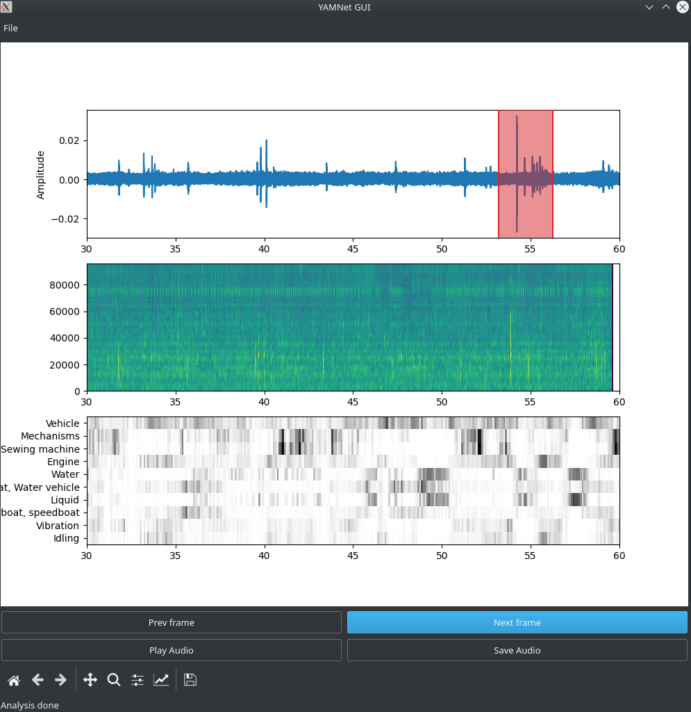

# YAMNet GUI - Sound Event Identification and Classification

This Python GUI program allows you to manually identify and classify sound events using the YAMNet model. YAMNet is a deep learning model trained on the AudioSet dataset for audio event recognition.

## Features

- Open and analyze WAV files
- Visualize waveform, spectrogram, and classification scores
- Navigate through the audio frames
- Crop and save audio segments
- Play audio segments

  

## Installation
Clone the main repository:

    git clone https://github.com/Adrihp06/YAMNet-GUI.git

Download the yamnet repository:
https://github.com/tensorflow/models/tree/master/research/audioset/yamnet

You will also need the pretrained weights for YAMNet if you don't have your own.

Make sure to place the downloaded yamnet.h5 file in the appropriate directory of your project.

## Usage

Once you run the program the GUI window will open, allowing you to interact with the program.

- Click the Open button to select a WAV file for analysis.
- Use the Next frame and Prev frame buttons to navigate through the audio frames.
- Click and drag on the waveform plot to select a portion of the audio.
- Click the Play Audio button to listen to the selected segment.
- Click the Save Audio button to save the selected segment as a WAV file.

## Limitations
At this moment you can only change the window of analisys inside the program.

The program performs well with audio files up to a sample rate of 380,000 Hz. However, it's important to note that spectrogram generation at high-frequency levels can consume a significant amount of memory. To ensure smooth execution and avoid memory issues, it is recommended to use window sizes of less than 30 seconds for analysis.

Please note that the program's performance may vary depending on the system specifications and available resources. It's always recommended to test the program with different audio files and adjust the window size accordingly for optimal performance.

You will notice that the axes are not perflectly shared, there is a little delay, this is because how yamnet calculates the espectrogram.

## Status

This program was created as a tool to analyze and classify audio files in an easy way. It is currently in its initial version and no further improvements or enhancements are planned.

